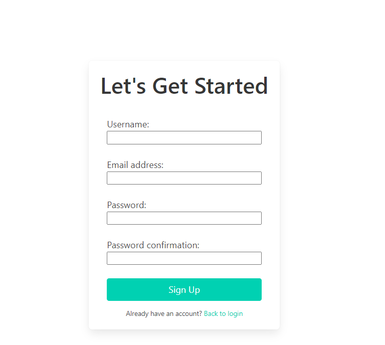
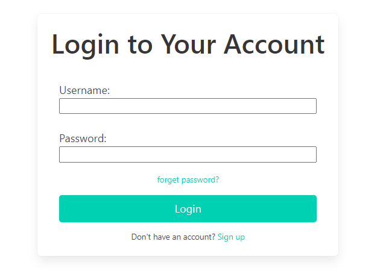
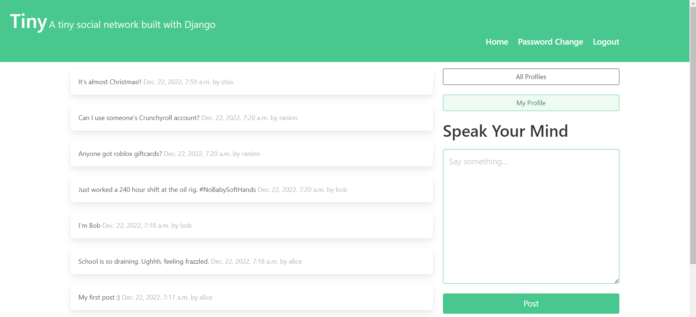
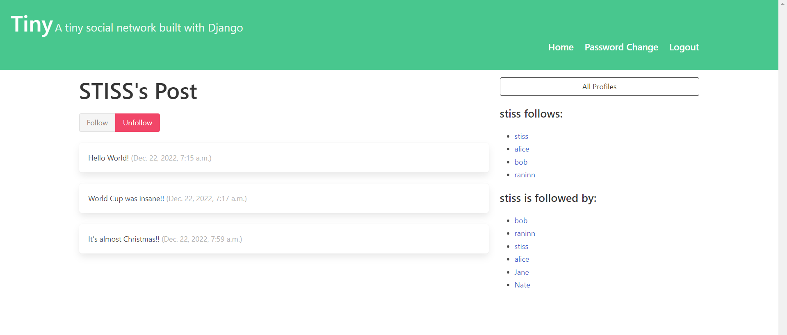

# Tiny
## About The Project
This is a social media platform built with Django. 

Here's what in it:
* A sign-up/login functionality
* Allows users to post short text-based messages. 
* The users of your app can follow other users to see their posts or unfollow them to stop seeing their posts.

Here are some project screenshots:
* 
* 
* 
* 
